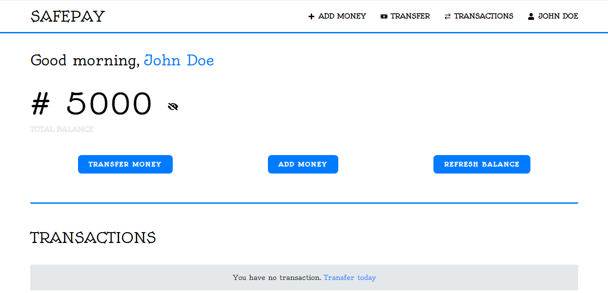
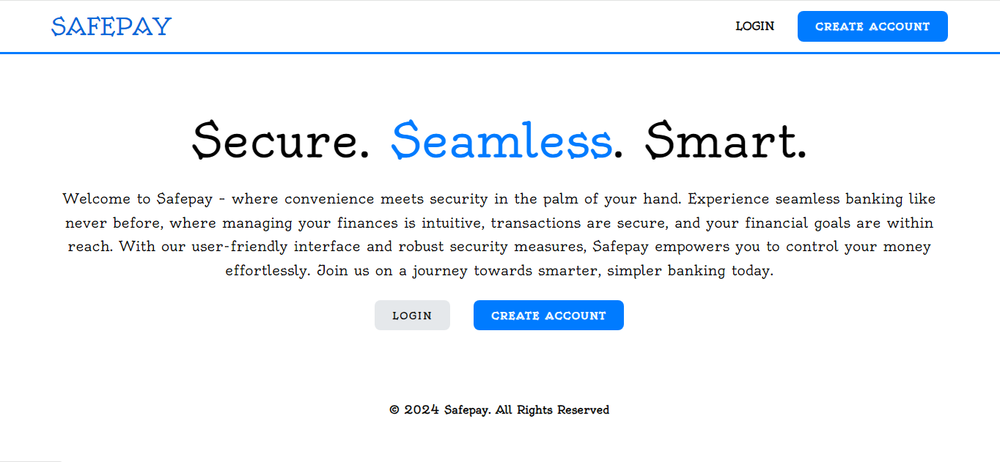
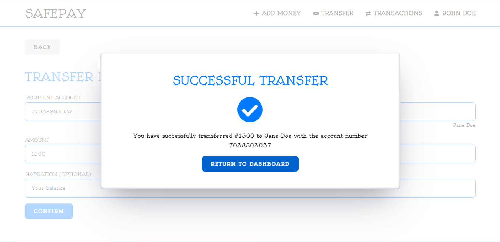

# Safepay Banking system

> A banking system built with the MERN stack and Redux.





## Features

-   User sign up and sign in
-   Tranfer of money from one account to another account
-   Transaction history
-   User profile with transactions
-   Database seeder (users)

## Usage

-   Create a MongoDB database and obtain your `MongoDB URI` - [MongoDB Atlas](https://www.mongodb.com/cloud/atlas/register)

### Env Variables

Rename the `.env.example` file to `.env` and add the following

```
NODE_ENV = development
PORT = 5000
MONGO_URI = your mongodb uri
JWT_SECRET = 'abc123'
```

Change the JWT_SECRET to what you want

### Install Dependencies (backend)

```
npm install
```

### Run

```

npm run server


## Build & Deploy


```

Sample User Logins

08027836001 (Customer)
1234567890

07038803037 (Customer)
1234567890

07033623935 (Customer)
1234567890

07015687868 (Customer)
1234567890

09033826455 (Customer)
1234567890

---

## License

The MIT License

Copyright (c) 2024 Tomiwa Adelae https://tomiwaadelae.netlify.app

Permission is hereby granted, free of charge, to any person obtaining a copy
of this software and associated documentation files (the "Software"), to deal
in the Software without restriction, including without limitation the rights
to use, copy, modify, merge, publish, distribute, sublicense, and/or sell
copies of the Software, and to permit persons to whom the Software is
furnished to do so, subject to the following conditions:

The above copyright notice and this permission notice shall be included in
all copies or substantial portions of the Software.

THE SOFTWARE IS PROVIDED "AS IS", WITHOUT WARRANTY OF ANY KIND, EXPRESS OR
IMPLIED, INCLUDING BUT NOT LIMITED TO THE WARRANTIES OF MERCHANTABILITY,
FITNESS FOR A PARTICULAR PURPOSE AND NONINFRINGEMENT. IN NO EVENT SHALL THE
AUTHORS OR COPYRIGHT HOLDERS BE LIABLE FOR ANY CLAIM, DAMAGES OR OTHER
LIABILITY, WHETHER IN AN ACTION OF CONTRACT, TORT OR OTHERWISE, ARISING FROM,
OUT OF OR IN CONNECTION WITH THE SOFTWARE OR THE USE OR OTHER DEALINGS IN
THE SOFTWARE.
